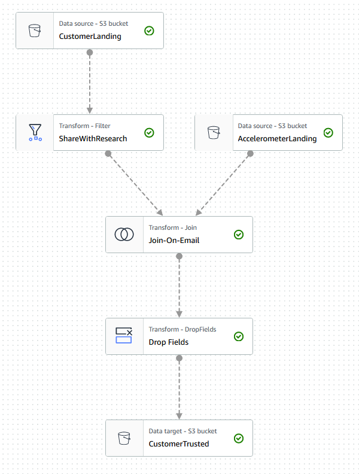
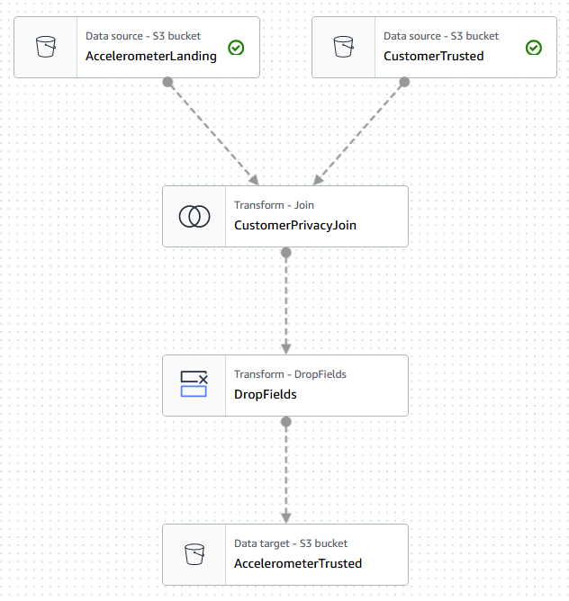
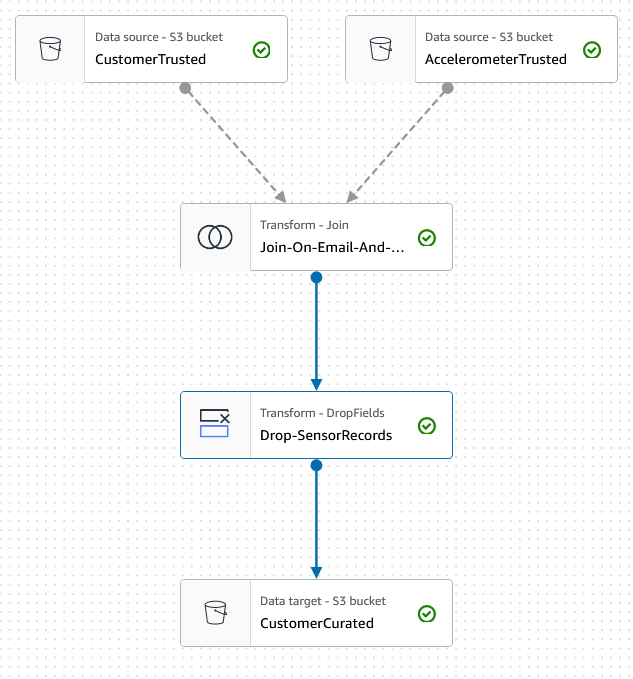
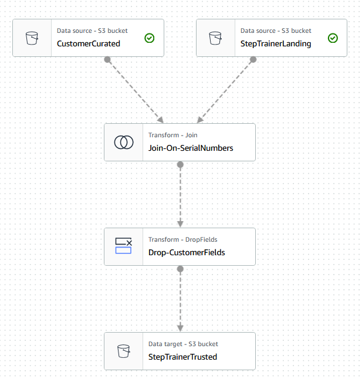
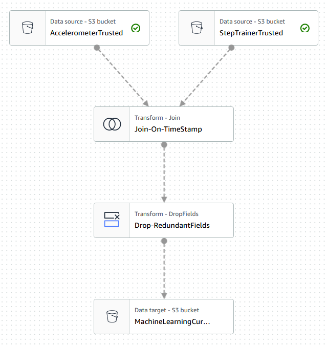

# README

This directory contains the STEDI project deliverables.

## Project Overview

The STEDI Human Balance Analytics project builds a data lakehouse solution for extracting and curating the data produced by the STEDI Step Trainer sensors and its associated mobile app. The lakehouse is built on AWS and the resulting data are to be used by Data Scientists to  train a learning model.

## S3 Landing Zone

The raw data coming from 3 various sources are stored on AWS S3 in the following 3 directories:
- s3://fab-se4s-bucket/stedi/accelerometer/landing
- s3://fab-se4s-bucket/stedi/customer/landing
- s3://fab-se4s-bucket/stedi/step_trainer/landing
    
## Python Scripts using Spark

### Customer Landind To Trusted
The `./stedi/customer_landing_to_trusted.py` script is a Glue job that applies a privacy policy on cutomer's data by filtering out the customers that did not give their approval to use their data for research purposes (i.e. the field `shareWithResearchAsOfDate` is set and is not zero).

*Fig.1 - Customer Landing To Trusted*

###  Accelerometer Trusted Zone
The `./stedi/accelerometer_landing_to_trusted_zone.py` script sanitizes the accelerometer data to  only store sensor records from customers who agreed to share their data for research purposes. The Glue job consists of two transforms:
- a **JOIN** based on the fields `customer_trusted.email` == `accelerometer_landing.user`
- a **DROP_FIELDS** that keeps only relevant sensor fields.

*Fig.2 - Accelerometer Trusted Zone*

###  Customer Curated Zone
The ` stedi/customer_trusted_to_curated.py` script 
sanitizes the trusted customer data to only include customers who have accelerometer data and have agreed to share their data for research. The Glue job consists of the following transforms:
- a **JOIN** of trusted customers with step-trainer records based on `serialNumber` ==  `serialNumber`
- a **DROP** of the unused record fields ('timeStamp', 'sensorReadingTime', distanceFromObject').

*Fig.3 - Customer Curated Zone*

### Step Trainer Trusted
The `stedi/trainer_trusted_to_curated.py` script sanitizes the step trainer data with records that contain the data from curated customers and who have agreed to share their data for research (customers_curated). The Glue job consists of the following JOIN and DROP transforms:
- a **JOIN** of curated_customers with step-trainer records based on `serialNumber` ==  `serialNumber`
- a **DROP** of the unused customer fields.

*Fig.4 - Step Trainer Trusted.png*

### Machine Learning Curated
The `stedi/machine_learning_curated.py` script 
aggregates the table that has the step trainer readings, and the table that has the associated accelerometer reading data for the same timestamp, but only for customers who have agreed to share their data.

 
*Fig.5 - Machine Learning Curated*

